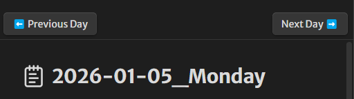

# obsidian-journal-prev-next

A plugin for Obsidian that adds "Previous Day" and "Next Day" buttons to your daily journal notes, allowing you to easily navigate between them.

This plugin is not available on the Obsidian Community Plugins list. You can download the latest release from the [Releases](https://github.com/sedlatschek/obsidian-journal-prev-next/releases) page.
